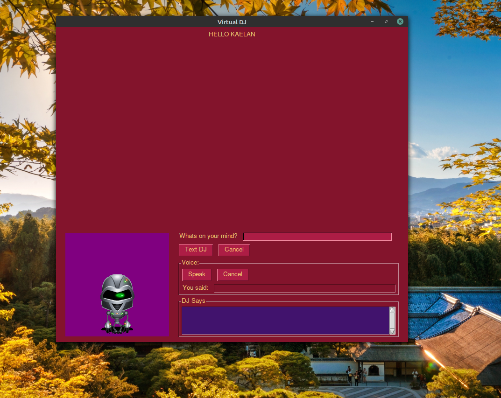

# Virtual-DJ Project
***
Since Covid started, it has practically ended nightlife, concerts , clubs and music . To heal my musical soul , i have an idea to create something like Siri or Alexis, with **addition function of scraping Youtube base on my commands and play back videos in a display**. Other basic functions include
1. search on google
2. search on duckduckgo for privacy search
3. reply base on results from wikipedia and alpha wolfram
4. tell me jokes
5. tell me the time 

